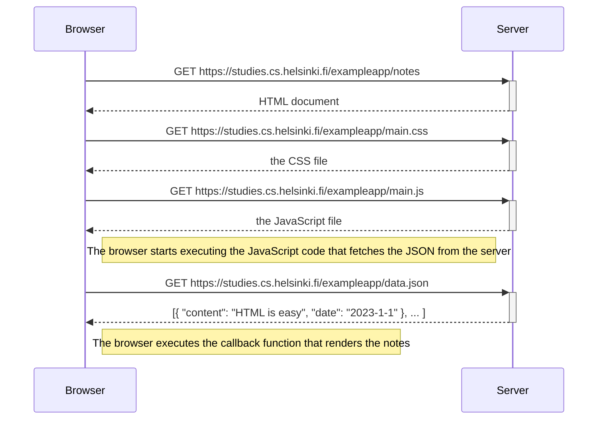
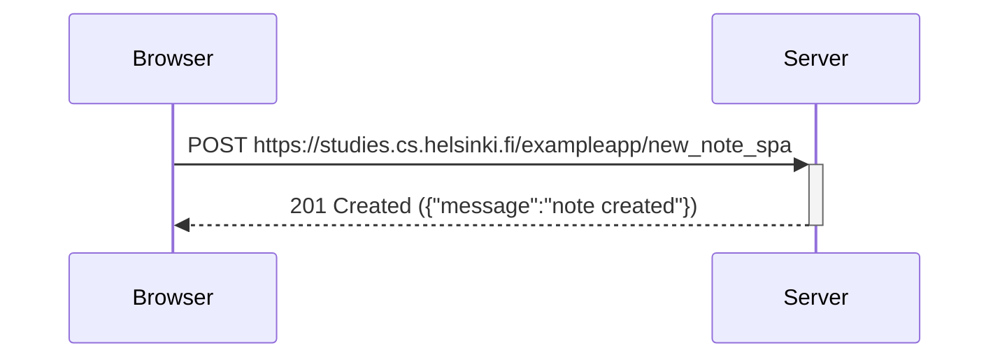

# Exercise-HTML-0.1.-0.6.
Latihan Belajar Dasar HTML
**0.4. (New note diagram)**
Simple Diagram:

**0.5. (Diagram situation where the user goes to the single-page app)**
Simple Diagram of Single-Page App:

**0.6. (New note in Single page app diagram)**
sequenceDiagram
    participant browser
    participant server

    Note over browser: User types a note and clicks "save"

    browser ->>+ server: POST https://studies.cs.helsinki.fi/exampleapp/new_note_spa
    activate server
    Note right of browser: The JavaScript sends the note data as JSON. The page does NOT reload.
    
    server -->>- browser: 201 Created ({"message":"note created"})
    deactivate server
    
    Note right of browser: The JavaScript receives the confirmation and dynamically adds the new note to the list on the screen.
